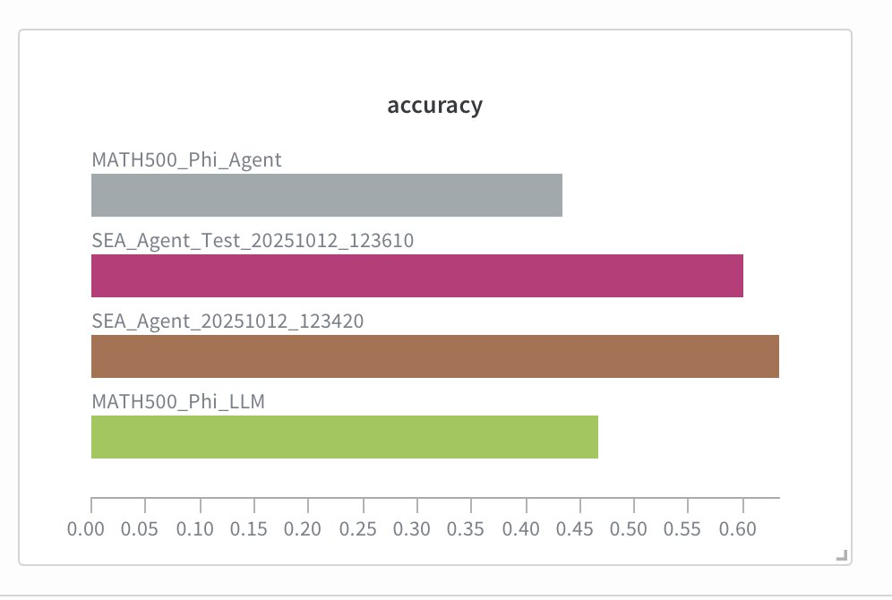
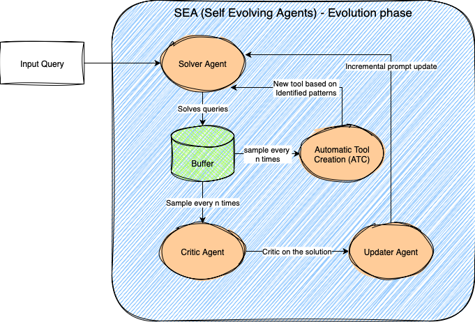

# Self-Evolving Agent (SEA)

Built a Self-Improving Agent (SEA) framework during Weights & Biases' WeaveHacks 2 (24-hour hackathon).

## Core Features

### 1. Automatic Prompt Updation
- **Pattern Recognition**: Identifies recurring failure patterns in agent responses
- **Critic System**: Analyzes incorrect outputs to understand root causes
- **Prompt Evolution**: Dynamically refines system prompts based on performance data
- **Iterative Improvement**: Continuously optimizes prompt effectiveness over time

### 2. Automatic Tool Creation
- **Tool Ideation**: Identifies opportunities for new tools based on task patterns
- **Code Generation**: Automatically generates LangChain-compatible tools
- **Validation & Testing**: Ensures generated tools are safe and functional
- **Dynamic Loading**: Seamlessly integrates new tools during agent execution

## Architecture



```
SEA Framework
├── Critic System          # Pattern recognition and failure analysis
│   ├── Analyzes incorrect outputs
│   ├── Identifies recurring patterns
│   └── Provides feedback for improvement
├── Updater System         # Prompt evolution and refinement
│   ├── Refines system prompts
│   ├── Incorporates critic feedback
│   └── Optimizes prompt effectiveness
├── ATC Engine             # Automatic Tool Creation
│   ├── Tool Ideator       # Identifies tool opportunities
│   ├── Tool Generator     # Creates LangChain tools
│   └── Tool Validator     # Tests and validates tools
├── Unified Orchestrator   # Coordinates all systems
│   ├── Manages training loop
│   ├── Integrates ATC when enabled
│   └── Handles tool loading
└── Weave Tracing          # Full observability with W&B
    ├── Tracks performance metrics
    ├── Monitors prompt evolution
    └── Logs tool creation events
```

## How SEA Works

### Evolve Phase
While solving tasks, auxiliary agents monitor traces and update system prompts and tools (passive learning; model parameters remain unchanged).

### Inference Phase
The evolved prompt and toolset are applied to new, unseen data.

## Evaluation Results



Tested SEA on the MATH 500 dataset using the Phi-4-3.8B model across four settings:
1. **Phi-4 baseline** - Base model performance
2. **Phi-4 + basic tools** - Model with calculator and format tools
3. **SEA (evolve phase)** - Performance after prompt evolution
4. **SEA (inference phase)** - Performance on unseen data with evolved prompts

**Results:** SEA outperformed the first two baselines by over 13% in both evolve and inference phases.

### Performance Metrics

- **Baseline Phi-4**: Starting accuracy on MATH 500
- **Phi-4 + Tools**: Improved accuracy with basic calculator/formatting tools
- **SEA Evolve Phase**: **+13% improvement** over baseline through prompt optimization
- **SEA Inference Phase**: Maintains **+13% improvement** on unseen test data

The SEA framework demonstrates consistent performance improvements through automated prompt evolution and tool creation, with the evolve phase showing strong learning capabilities and the inference phase validating generalization to new problems.

## Setup

1. Install dependencies:
```bash
uv sync
```

2. Configure environment:
```bash
cp .env.example .env
# Add your GOOGLE_API_KEY and WANDB_API_KEY to .env
```

3. Run SEA training:
```bash
PYTHONPATH=. python scripts/run_sea_training.py \
    --total-problems 50 \
    --update-frequency 10 \
    --enable-atc
```

## Usage

### Basic Inference
```python
from src.llm import run_inference

response = run_inference("Your prompt here")
```

### SEA Training with Automatic Tool Creation
```python
from scripts.run_sea_training import run_sea_training

# Train SEA with ATC enabled
run_sea_training(
    total_problems=50,
    update_frequency=10,
    use_llm_eval=True,
    enable_atc=True,          # Enable Automatic Tool Creation
    experiment_id="exp_001",
    agent_name="math_solver"
)
```

### Load Agent with Dynamic Tools
```python
from src.agents.shared.tool_loader import load_agent_tools

# Load all tools (core + auto-generated)
tools = load_agent_tools("math_solver", include_generated=True)
```

## Documentation

- [Integration Summary](INTEGRATION_SUMMARY.md) - Unified SEA training system
- [Automatic Tool Creation](docs/automatic_tool_creation_engine.md) - ATC engine details
- [Critic Tuner System](docs/CRITIC_TUNER_SYSTEM.md) - Pattern recognition system
- [Phase 4 Implementation](docs/PHASE4_IMPLEMENTATION.md) - Advanced features
- [Tool Creation Quickstart](TOOL_CREATION_QUICKSTART.md) - Get started with ATC
